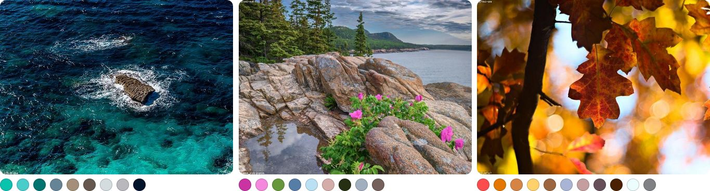

# Extract Colors

[](https://www.npmjs.com/package/extract-colors)
[](https://bundlephobia.com/result?p=extract-colors)
[](https://bundlephobia.com/result?p=extract-colors)
[](https://www.npmjs.com/package/extract-colors?activeTab=dependencies)
[](https://github.com/Namide/extract-colors/actions)
[](https://codecov.io/gh/Namide/extract-colors)
[](#license)
[](https://www.npmjs.com/package/extract-colors)

Extract color palettes from images.  
Simple use, < 6kB minified, gzip ≈ 2kB, fast process and no dependencies for browser.  
Need image reader dependence for node.js

[Website](https://extract-colors.namide.com/) | [Demo](https://extract-colors.namide.com/demo) | [Guide](https://extract-colors.namide.com/guide)



## Requirements

### Browsers

- Firefox: 29+
- Chrome: 33+
- Edge: 12+
- Opera: 19+
- Safari: 8+
- Webview Android: 4.4.3+
- Samsung Internet: 2.0+
- ~~Internet Explorer~~

### Node

- Node.js: 6.0+

## Install

### For browser

```bash
npm install --save extract-colors
```

### For node.js

Need to install an ImageData extractor like `get-pixels`

```bash
npm install --save extract-colors get-pixels
```

## Usage

### Browser example

```js
import { extractColors } from "extract-colors";

const src = "my-image.jpg";

extractColors(src).then(console.log).catch(console.error);
```

> You can use different types for `src` param (`String` for a path of image, `HTMLImageElement` or `ImageData`).

### Node.js example

```js
const path = require("path");
const getPixels = require("get-pixels");
const { extractColors } = require("extract-colors");

const src = path.join(__dirname, "./my-image.jpg");

getPixels(src, (err, pixels) => {
  if (!err) {
    const data = [...pixels.data];
    const [width, height] = pixels.shape;

    extractColors({ data, width, height }).then(console.log).catch(console.log);
  }
});
```

> This example use `get-pixels` but you can change the lib.
> Just send the ImageData object to `extractColors(imageData)`.

### ExtractorOptions

```js
const options = {
  pixels: 64000,
  distance: 0.22,
  colorValidator: (red, green, blue, alpha = 255) => alpha > 250,
  saturationDistance: 0.2,
  lightnessDistance: 0.2,
  hueDistance: 0.083333333,
};

extractColors(src, options).then(console.log).catch(console.error);
```

**pixels**  
_Total pixel number of the resized picture for calculation_  
Type: `Integer`  
Default: `64000`

**distance**  
_From 0 to 1 is the color distance to not have near colors (1 distance is between white and black)_  
Type: `Number`  
Default: `0.22`

**colorValidator**  
_Test function to enable only some colors_  
Type: `Function`  
Default: `(red, green, blue, alpha = 255) => alpha > 250`

**crossOrigin**  
_Only for browser, can be 'Anonymous' to avoid client side CORS_
_(the server side images need authorizations too)_  
Type: `String`  
Default: `""`

**requestMode**  
_Only for Web Workers in browser: it's used to determine if cross-origin requests lead to valid responses, and which properties of the response are readable_  
Type: `String`  
Default: `cors`

**saturationDistance**  
_Minimum saturation value between two colors otherwise the colors will be merged (from 0 to 1)_
Type: `String`  
Default: `0.2`

**lightnessDistance**  
_Minimum lightness value between two colors otherwise the colors will be merged (from 0 to 1)_
Type: `String`  
Default: `0.2`

**hueDistance**  
_Minimum hue value between two colors otherwise the colors will be merged (from 0 to 1)_
Type: `String`  
Default: `0.083333333`

## Return of the promise

Array of colors with the followed properties:

```js
[
  {
    hex: "#858409",​​
    red: 133,​​
    green: 132,​​
    blue: 9,​​
    hue: 0.16532258064516128,​​
    intensity: 0.4862745098039216,​​
    lightness: 0.2784313725490196,​​
    saturation: 0.8732394366197184,
    area: 0.0004
  },
  ...
]
```

| Field      | Example | Type    | Description                                               |
| ---------- | ------- | ------- | --------------------------------------------------------- |
| hex        | #858409 | String  | color in hexadecimal string                               |
| red        | 133     | Integer | red canal from 0 to 255                                   |
| green      | 132     | Integer | green canal from 0 to 255                                 |
| blue       | 9       | Integer | blue canal from 0 to 255                                  |
| hue        | 0.1653  | Number  | color tone from 0 to 1                                    |
| intensity  | 0.4862  | Number  | color intensity from 0 to 1                               |
| lightness  | 0.2784  | Number  | color lightness from 0 to 1                               |
| saturation | 0.8732  | Number  | color saturation from 0 to 1                              |
| area       | 0.0004  | Number  | area of the color and his neighbouring colors from 0 to 1 |

## License

[MIT](https://opensource.org/licenses/MIT)

Copyright (c) 2025-present, Damien Doussaud
