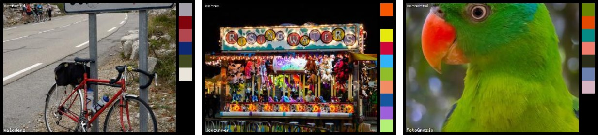

# Extract Colors

[](https://www.npmjs.com/package/extract-colors)
[](https://bundlephobia.com/result?p=extract-colors)
[](https://bundlephobia.com/result?p=extract-colors)


[](https://github.com/Namide/extract-colors/actions)
[](https://codecov.io/gh/Namide/extract-colors)
[](#license)
[](https://www.npmjs.com/package/extract-colors)

Extract color palettes from images.  
Simple use, < 5ko minified, fast process and no dependencies for browser.  
Dependency to canvas for node.js



Try the [demo](https://namide.github.io/extract-colors/)

## Requirements

### Browsers

- Firefox: 29+
- Chrome: 33+
- Edge: 12+
- Opera: 19+
- Safari: 8+
- Webview Android: 4.4.3+
- Samsung Internet: 2.0+
- ~~Internet Explorer~~


### Node

- Node.js: 0.12+


## Install

### For browser

```bash
npm install --save extract-colors
```


### For node.js

Need to install dependency `canvas`

```bash
npm install --save extract-colors canvas
```


## Usage

### Browser example

```js
import extractColors from 'extract-colors'

const src = 'my-image.jpg'

extractColors(src)
  .then(console.log)
  .catch(console.error)
```

> You can use different types for `src` param (`String` for a path of image, `Image` or `ImageData`).  
> If you use `ImageData` type, be carrefull because the extractor will not optimize the process (it will not reduce the count of pixels).


### Node.js example

```js
const path = require('path')
const { extractColors } = require('extract-colors')

const src = path.join(__dirname, './my-image.jpg')

extractColors(src)
  .then(console.log)
  .catch(console.log)
```

> You can use different types for `src` param (`String` for a path of image or `ImageData`).  
> If you use `ImageData` type, be carrefull because the extractor will not optimize the process (it will not reduce the count of pixels).


### Options

```js
const src = 'my-image.jpg'

const options = {
  pixels: 10000,
  distance: 0.2,
  saturationImportance: 0.2,
  splitPower: 10,
  colorValidator: (red, green, blue, alpha = 255) => alpha > 250
}

extractColors(src, options)
  .then(console.log)
  .catch(console.error)
```

**pixels**  
_Total pixel number of the resized picture for calculation_  
Type: `Integer`  
Default: `10000`  

**distance**  
_From 0 to 1 is the color distance to not have near colors (1 distance is between white and black)_  
Type: `Number`  
Default: `0.2`  

**saturationImportance**  
_Power of the saturation weight during the process (0 is not used, 1 is only saturation and not area size)_  
Type: `Number`  
Default: `0.2`  

**splitPower**  
_Approximation power in the first color splitting during process (from 2 to 16)_  
Type: `Integer`  
Default: `10`  

**colorValidator**  
_Test function to enable only some colors_  
Type: `Function`  
Default: `(red, green, blue, alpha = 255) => alpha > 250`  

**crossOrigin**  
_Only for browser, can be 'Anonymous' to avoid client side CORS_
_(the server side images need authorizations too)_  
Type: `String`  
Default: `null`  


## Return of the promise

Array of colors with the followed properties:

```js
[
  {
    hex: '#62342b',
    red: 98,
    green: 52,
    blue: 43,
    area: 0.5915,
    saturation: 0.2156862
  },
  ...
]
```

| Field | Example | Type | Description |
|---|---|---|---|
| hex | #62342b | String | color in hexadecimal string |
| red | 98 | Integer | red canal from 0 to 255 |
| green | 52 | Integer | green canal from 0 to 255 |
| blue | 43 | Integer | blue canal from 0 to 255 |
| area | 0.5915 | Number | area of the color and his neighbouring colors from 0 to 1 |
| saturation | 0.2156862 | Number | color saturation from 0 to 1 |


## API doc

Read the [API doc here](https://namide.github.io/extract-colors/doc/)


## License

Copyright (C) 2019  Damien Doussaud

This program is free software: you can redistribute it and/or modify
it under the terms of the GNU General Public License as published by
the Free Software Foundation, either version 3 of the License, or
(at your option) any later version.

This program is distributed in the hope that it will be useful,
but WITHOUT ANY WARRANTY; without even the implied warranty of
MERCHANTABILITY or FITNESS FOR A PARTICULAR PURPOSE.  See the
GNU General Public License for more details.

You should have received a copy of the GNU General Public License
along with this program.  If not, see <https://www.gnu.org/licenses/>.
