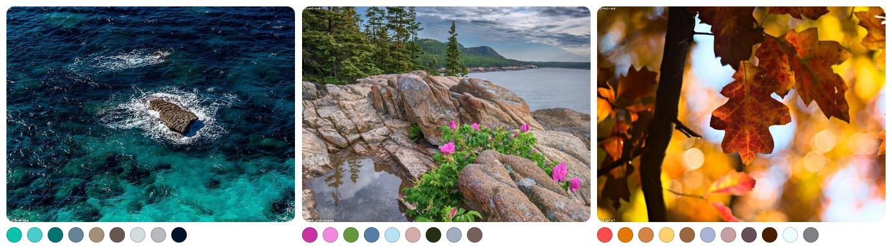

# Extract Colors

[](https://www.npmjs.com/package/extract-colors)
[](https://bundlephobia.com/result?p=extract-colors)
[](https://bundlephobia.com/result?p=extract-colors)
[](https://www.npmjs.com/package/extract-colors?activeTab=dependencies)
[](https://github.com/Namide/extract-colors/actions)
[](https://codecov.io/gh/Namide/extract-colors)
[](#license)
[](https://www.npmjs.com/package/extract-colors)

Extract color palettes from images.  
Simple use, < 20kB minified, gzip ≈ 8kB, fast process and no dependencies for browser.
Can be tree shakabled.  
Need image reader dependence for node.js

[Website](https://extract-colors.namide.com/) | [Demo](https://extract-colors.namide.com/demo) | [Guide](https://extract-colors.namide.com/guide)



## Requirements

### Browsers

- Firefox: 29+
- Chrome: 33+
- Edge: 12+
- Opera: 19+
- Safari: 8+
- Webview Android: 4.4.3+
- Samsung Internet: 2.0+
- ~~Internet Explorer~~

### Node

- Node.js: 6.0+

## Install

### For browser

```bash
npm install --save extract-colors
```

### For node.js

Need to install an ImageData extractor like `get-pixels`

```bash
npm install --save extract-colors get-pixels
```

## Usage

### Browser example

```js
import { extractColors } from "extract-colors";

const src = "my-image.jpg";

extractColors(src).then(console.log).catch(console.error);
```

> You can use different types for `src` param (`String` for a path of image, `HTMLImageElement` or `ImageData`).

### Node.js example

```js
const path = require("path");
const getPixels = require("get-pixels");
const { extractColors } = require("extract-colors");

const src = path.join(__dirname, "./my-image.jpg");

getPixels(src, (err, pixels) => {
  if (!err) {
    const data = [...pixels.data];
    const [width, height] = pixels.shape;

    extractColors({ data, width, height }).then(console.log).catch(console.log);
  }
});
```

> This example use `get-pixels` but you can change the lib.
> Just send the ImageData object to `extractColors(imageData)`.

### ExtractorOptions

```js
const options = {
  pixels: 64000,
  distance: 0.2,
  colorValidator: (red, green, blue, alpha = 255) => alpha > 250,
  defaultColors: ["dominants", "accents"],
};

extractColors(src, options).then(console.log).catch(console.error);
```

**pixels**  
_Total pixel number of the resized picture for calculation_  
Type: `Integer`  
Default: `64000`

**fastDistance**  
_From 0 to 1 is the RGB color distance to not have near colors (1 distance is between white and black). Increase the value accelerate the calculation and reduce the output list of colors._  
Type: `Number`  
Default: `distance / 2` or `0.2`

**distance**  
_Minimum distance between two colors otherwise the colors will be merged (from 0 to 1). Calculation with the L*a*b\* CIE deltaE color distance._  
Type: `Number`  
Default: `fastDistance * 2` or `0.22`

**colorValidator**  
_Test function to enable only some colors_  
Type: `Function`  
Default: `(red, green, blue, alpha = 255) => alpha > 250`

**crossOrigin**  
_Only for browser, can be 'Anonymous' to avoid client side CORS_
_(the server side images need authorizations too)_  
Type: `String`  
Default: `""`

**requestMode**  
_Only for Web Workers in browser: it's used to determine if cross-origin requests lead to valid responses, and which properties of the response are readable_  
Type: `String`  
Default: `cors`

**colorClassifications**  
_List of classified types of colors_  
Type: `String[]`  
Default: `[ "dominants", "accents", "dominantsLight", "dominantsMidtone", "dominantsDark", "accentsLight", "accentsMidtone", "accentsDark", "dullests", "vivids", "dullestsLight", "dullestsMidtone", "dullestsDark", "vividsLight", "vividsMidtone", "vividsDark", "lightests", "midtones", "darkests", "warmest", "coolest", "warmestLight", "warmestMidtone", "warmestDark", "coolestLight", "coolestMidtone", "coolestDark" ]`

**defaultColors**  
_Default classified colors if no colors founds in the image_  
Type: `Boolean` or `{ [colorClassifications]?: Boolean, Number or () => Number }`
Default: `false`

**defaultMainColor**
_Default classified color if no colors found in the image and if `defaultColors` is not `false`_  
Type: `Number`  
Default: `0x0077ff`

---

## Return of the promise

Array of colors with the followed properties:

```js
{
  list: [
    {
      hex: number,​​ // from 0x000000 to 0xFFFFFF
      hexString: "#858409", // from "#000000" to "#FFFFFF"
      area: number, // from 0 to 1
      rgb: [number, number, number], // RGB colors (from 0 to 255 by chanel)
      hsl: [number, number, number], // HSL colors (from 0 to 1 by chanel)
      ecHsl: [number, number, number], // Fake HSL calculated from CIELAB colors (from 0 to 1 by chanel)
      lab: [number, number, number], // CIELAB colors
      count: number // number of pixel near of this color or near colors (determined with distance and fastDistance)
    },
    ...
  ],
  dominants: [...],
  accents: [...],
  ...
}
```

| Field     | Example                   | Type                     | Description                                               |
| --------- | ------------------------- | ------------------------ | --------------------------------------------------------- |
| hex       | 0x858409                  | String                   | color in hexadecimal string                               |
| hexString | #858409                   | String                   | color in hexadecimal string                               |
| area      | 0.0004                    | Number                   | area of the color and his neighbouring colors from 0 to 1 |
| rgb       | [133, 132, 9]             | [uint, uint, uint]       | red, green, blue canals from 0 to 255                     |
| hsl       | [0.16532 0.87323 0.27843] | [Number, Number, Number] | hue, saturation, lighness values from 0 to 1              |
| ecHsl     | [todo]                    | [Number, Number, Number] | hue, saturation, lighness values from 0 to 1              |
| lab       | [53.503, -12.585, 56.463] | [Number, Number, Number] | hue, saturation, lighness values from 0 to 1              |
| count     | 1337                      | Number                   | number of pixel near of this color or near colors         |

## License

Copyright (C) 2019-present Damien Doussaud

This program is free software: you can redistribute it and/or modify
it under the terms of the GNU General Public License as published by
the Free Software Foundation, either version 3 of the License, or
(at your option) any later version.

This program is distributed in the hope that it will be useful,
but WITHOUT ANY WARRANTY; without even the implied warranty of
MERCHANTABILITY or FITNESS FOR A PARTICULAR PURPOSE. See the
GNU General Public License for more details.

You should have received a copy of the GNU General Public License
along with this program. If not, see <https://www.gnu.org/licenses/>.
